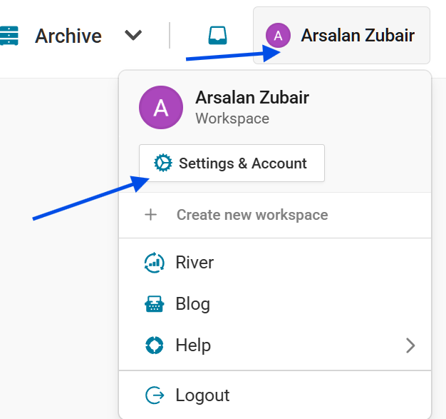
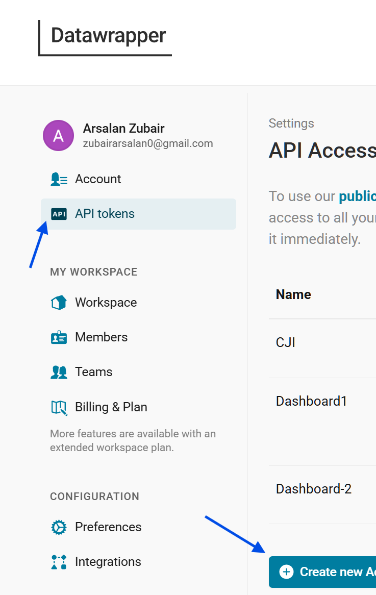
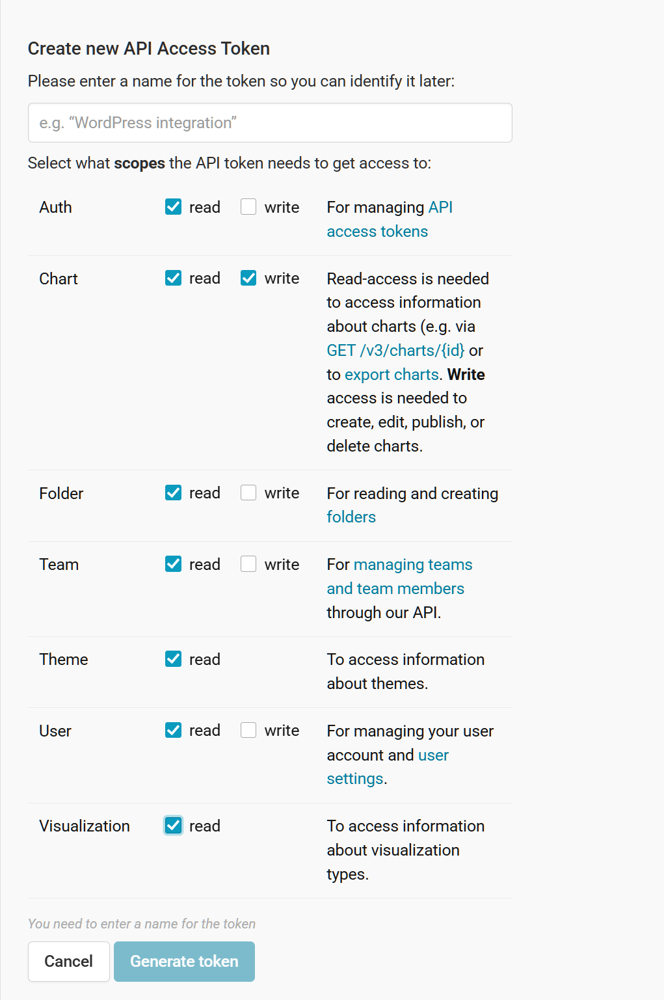
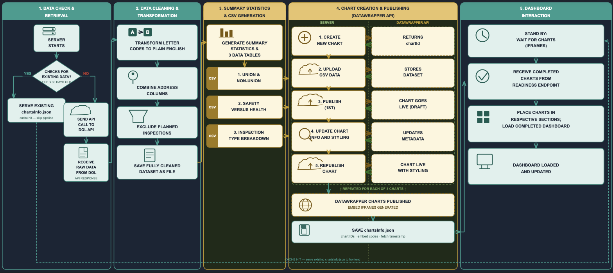
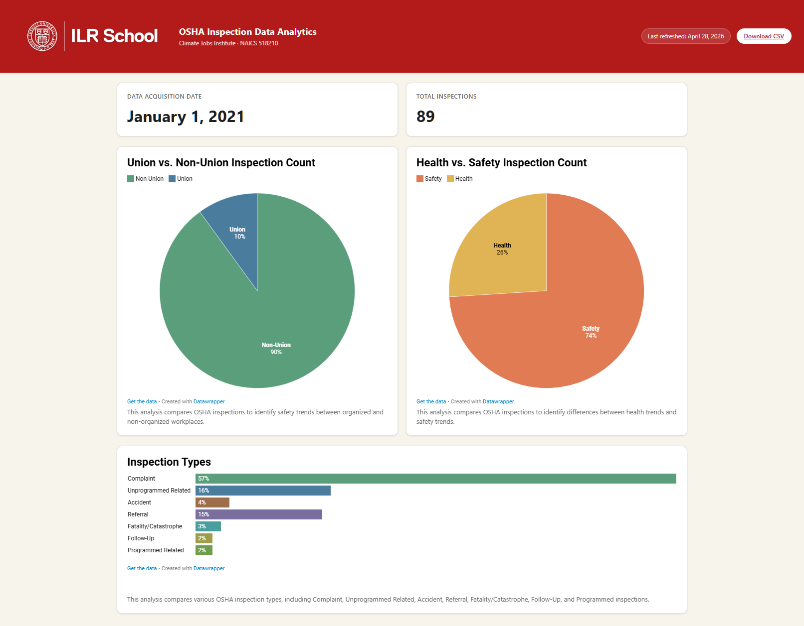

# Cornell Climate Jobs Institute - Data Center Inspection Dashboard (DCID)

> **Disclaimer:** This prototype was built over 4 weeks as part of a client-student partnership through Codesmith’s Future Code program. It explores solutions to a real-world case study provided by an external partner. This work does not represent employment or contracting with the partner. All intellectual property belongs to the partner. This is a time-boxed MVP and not a production system.

## Project Overview

The DCID is a prototype web application and data pipeline designed to support research for the **Cornell Climate Jobs Institute**. Its primary objective is to analyze and find patterns in workplace safety, union status, and inspection activity within the United States data center industry. 

This project serves as an MVP to validate a programmatic data-to-visualization workflow. It automates the extraction of inspection records from the Department of Labor API, specifically targeting data centers (NAICS code 518210). The pipeline cleans and transforms raw data before utilizing the Datawrapper API to dynamically generate charts. These visualizations are then presented through a React-based frontend dashboard.

**Key Objectives:**

* **Automated Ingestion:** Programmatically fetch and filter OSHA inspection data from a fixed start date of January 1, 2021.
* **Data Transformation:** Clean and aggregate raw government data into structured formats suitable for charting.
* **Insight Generation:** Visualize critical industry metrics, including safety vs health inspection focus, union vs non-union status, and inspection type distributions across US data center facilities.

## Tech Stack

**Languages**

* **TypeScript / JavaScript:** Core programming languages utilized across both the frontend client and backend server.

**Frontend**

* **React:** UI construction utilizing core state hooks and `useQuery` for data synchronization.
* **Vite:** Frontend build tool and bundler used for rapid development and optimized production builds.
* **CSS:** Styling language for designing Dashboard user interface.
* **TanStack:** Client checks to see if server is live before fetching to prevent software race conditions.

**Backend & Data Processing**

* **Node.js:** Server environment handling secure external API requests, data cleaning, and pipeline orchestration.
* **json-2-csv:** Data transformation utility used to convert processed JSON inspection data into the CSV format required by Datawrapper.

**APIs & Visualization**


* **Department of Labor (DOL) API:** Primary data source for fetching raw OSHA inspection records.
```
Inspection Dataset: https://data.dol.gov/datasets/10313
```
* **Datawrapper API:** Utilized on the backend for programmatic dataset uploading, chart generation, and publishing.
```
API Reference Documentation: https://developer.datawrapper.de/reference/introduction
```

## Setup Instructions

The application requires API keys for the Department of Labor and Datawrapper

* **DOL API**

*Create your account and generate your API token for use in the link below*

```
Register for Account: https://data.dol.gov/registration
```

* **Datawrapper**

*Create your account and generate your API key*

```
Register for Account: https://app.datawrapper.de/signin
```
*Follow the screenshot guide below to create and configure your API Key*

*Navigate to account page after login*



*Find to API Tokens*



*Configure Token Permissions*




Once the keys are generated they are loaded from a `.env` file inside the `server/` directory. To Create the file paste the following code in your terminal:

```bash
touch server/.env
```

*Then open `server/.env` from your file explorer in VS Code and paste the following, replacing the bracketed placeholders (Including the brackets) with your own API keys:*

```env
# Department of Labor API Key (from data.dol.gov)
DOL_API_KEY=[INSERT API KEY HERE]

# Datawrapper Personal Access Token
DWAPI_KEY=[INSERT API KEY HERE]

# Local Server Port (server defaults to 8888 if unset)
PORT=8888
```

## Project Structure

```
CJI-Dashboard/
├── assets/                  # Screenshots used in documentation                 
├── client/                  # React + Vite frontend (dashboard UI)
│   ├── components/          # Reusable React UI components (cards, rows, header, footer)
│   └── public/              # Static assets served by Vite
└── server/                  # Node.js + TypeScript backend
    ├── controllers/         # DOL fetch + Datawrapper publishing logic
    ├── data/                # Generated/cached data artifacts
    │   ├── Json/            # Json formatted files generated throughout data processing
    │   ├── general_csv/     # Overall CSV files generated after data processing
    │   └── visualization/   # Specific CSV files programatically converted to datawrapper appropriate formats
    ├── routes/              # Express route definitions
    └── utils/               # Shared utilities (data scrubber, chart metadata writer)
```

## How to Run

To install all necessary dependencies run the following command in your terminal:

```
npm run install:all
```

Once setup is complete and all packages have been installed, you can start both the server and the client together with a single command:

```bash
npm start
```

This runs `concurrently` to launch the Node.js backend (default `http://localhost:8888`) and the Vite dev server. Once the client is live, open **http://localhost:5173** in your browser to see the dashboard.


## Architecture Summary

> **Status (Prototype):** The DCID uses a time-based caching strategy to minimize unnecessary external API calls, executing data transformations and chart generation only when required.

**Data Flow:**



1.  **Initialization & Cache Check:** On server startup, the backend checks for the existence of `chartsInfo.json`, a local file containing chart metadata and the last data fetch timestamp. If the file exists and the last fetch occurred within the last 30 days, the server bypasses the data pipeline and serves the existing charts to the frontend.
2.  **Data Extraction (DOL API):** If `chartsInfo.json` is missing, or if the 30-day cache has expired, the Node.js server queries the Department of Labor (DOL) API for the latest inspection dataset.
3.  **Cleaning & Transformation:** The raw JSON payload is processed through a scrubbing pipeline that decodes internal letter codes into human-readable language, combines individual address fields into a single full address for future mapping capability, excludes planned inspections from the dataset, and handles any missing or unknown field values.
4.  **Aggregation:** The transformed JSON is mapped and tallied to calculate specific metrics, resulting in three distinct datasets:
    * Union vs. Non-Union facilities
    * Safety vs. Health inspection focus
    * Inspection type breakdowns
5.  **CSV Generation & Formatting:** The three aggregated datasets are converted into individual CSV files. These files are programmatically flattened to match Datawrapper's strict formatting requirements.
6.  **Chart Creation & Publishing (Datawrapper API):** For each of the three charts, the server executes a sequence of API calls to Datawrapper: the chart is created and assigned an ID, the corresponding CSV is uploaded, an initial publish is triggered, styling and metadata are patched to apply colors and percentage formatting, and the chart is republished so the final configuration goes live. This two-pass publish sequence is required because Datawrapper does not apply metadata patches until after the first publish.
7.  **Metadata Storage:** Upon successful publishing, the chart IDs and the new fetch timestamp are saved into the `chartsInfo.json` array. This metadata is then passed to the React frontend to render the embed codes and resets the 30-day update cycle.

## Limitations

* **Prototype scope:** Built as a time-boxed MVP for a Codesmith Future Code partnership, not hardened for production use.
* **Industry-specific:** The DOL query is hardcoded to NAICS code `518210` (data centers). Other industries are out of scope without code changes.
* **Bounded historical window:** Data fetch is hard-coded for any inspections on or after January 1, 2021
* **Cache staleness:** The 30-day refresh cycle means the dashboard can surface data up to a month behind the DOL source.
* **No authentication:** The backend API is unauthenticated; intended for local/internal use only.
* **Third-party limits:** Datawrapper & DOL can apply rate limits to chart creation & data fetching respectively. 

## Next Steps

* **Database connection:** The first suggestion is to move data to a database for persistent storage. Right now, there is no persistent place to store the data we're retrieving or what's being sent to Datawrapper. A database gives the system one centralized place to store incoming OSHA data, chart configurations, and publish history. 
* **Class constructor:** The second recommendation is abstracting the Datawrapper chart creation process into a dedicated class. Right now, generating a chart requires a series of network requests, and that logic is spread across the backend. Wrapping that into a ChartService class means any developer working on this in the future doesn't need to understand the full Datawrapper handshake just to create or update a chart. They call a method, and the class handles the rest. It also means if the team ever wants to move away from Datawrapper entirely, that change is isolated to one place rather than scattered throughout the codebase.

## Screenshots
Here is a screenshot of the dashboard:


